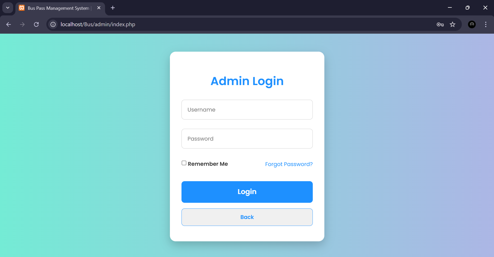
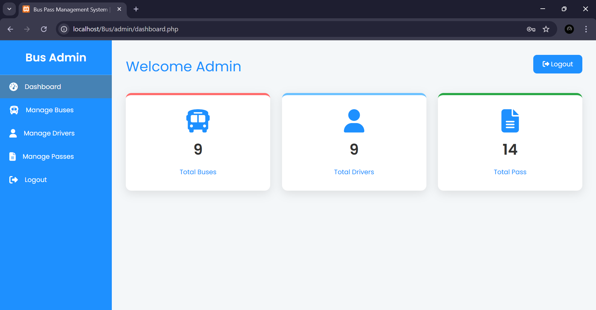
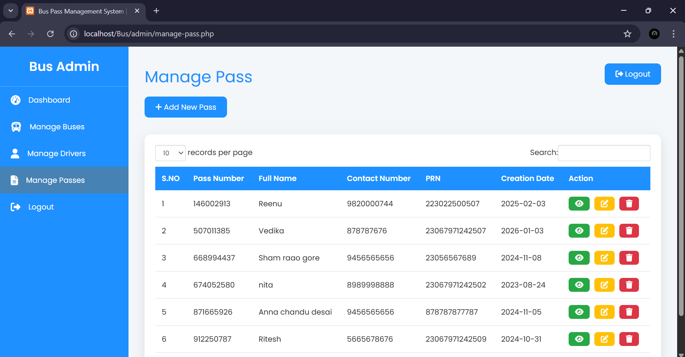
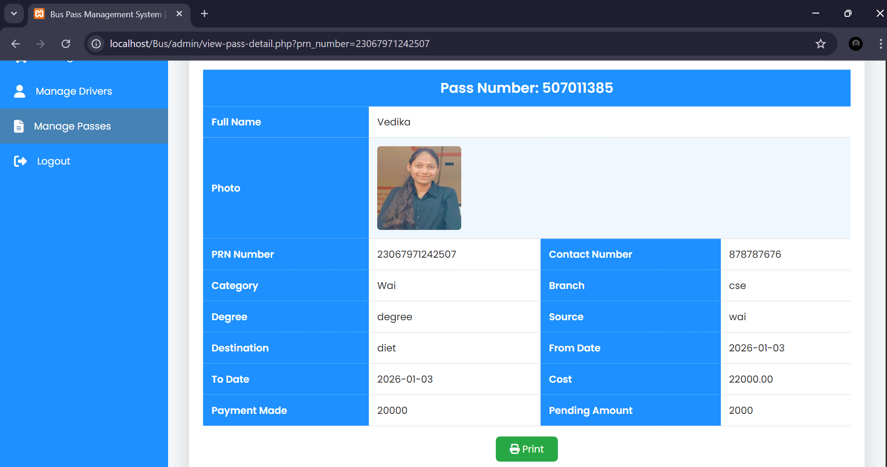
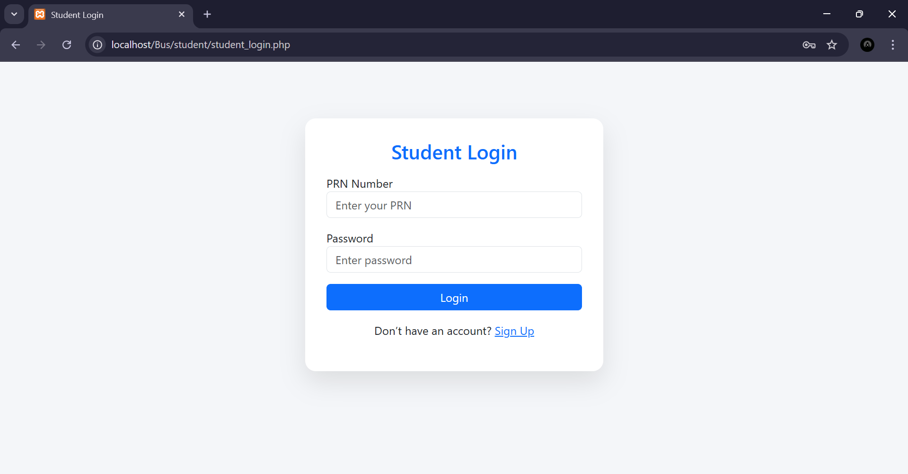
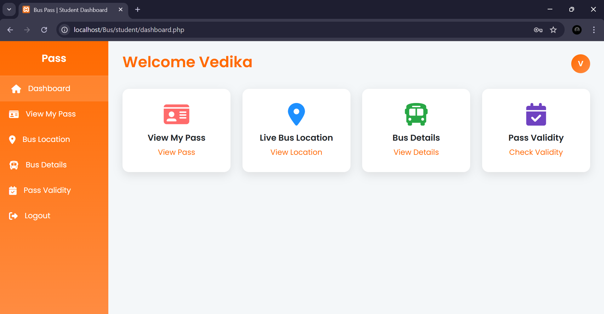
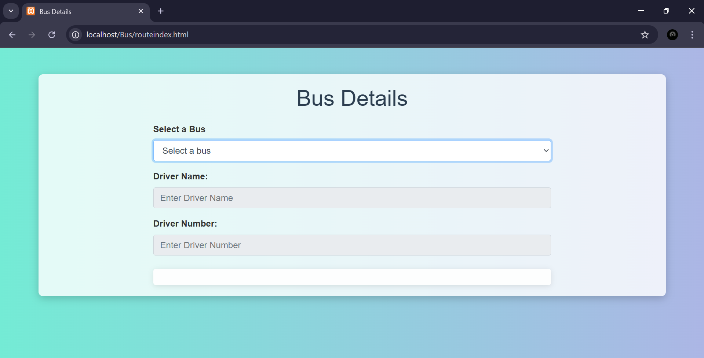

# 🚌 Bus-Pass-Management-System
A full-stack web application for managing student bus passes, bus categories, drivers, and routes.
This project includes separate **Admin** and **Student** panels with secure authentication and a responsive UI.

---

## 📌 Features
### Home Panel
### 👨‍💼 Admin Panel
- Admin login authentication
- Dashboard overview
- Manage bus categories
- Manage student bus passes
- View bus details
- Check pass validity
  ### 🔐 Admin Login

### 📊 Admin Dashboard

### 🧾 Manage Pass

### 📄 View Pass

### 🎓 Student Panel
- Student login
- View dashboard
- View bus pass details
- Search bus pass
- Check pass validity
### 🎓 Student Login

### 🏠 Student Dashboard

### 🚌 Bus Details

## 🛠️ Technologies Used
- **Frontend:** HTML, CSS, JavaScript, Bootstrap
- **Backend:** JSP / PHP (based on setup)
- **Database:** MySQL
- **Server:** Apache (XAMPP)
- **IDE:** NetBeans 

## ⚙️ How to Run the Project

1. Install **XAMPP**
2. Start **Apache** and **MySQL**
3. Import database:
   - Open phpMyAdmin
   - Create a database 
   - Import `buspassdb.sql`
4. Place project folder inside:
   Htdocs
6. Open browser and run Project
   

